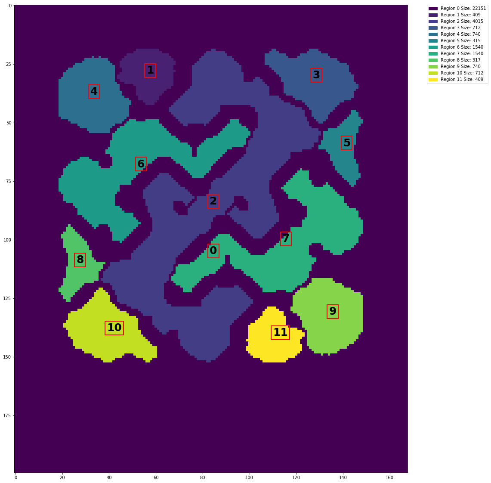
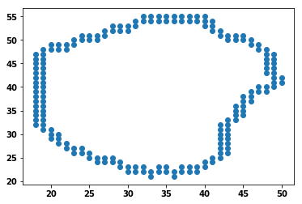

# SC2MapAnalysis

Early Stage Draft, 
to get an idea of what the api can do,  check out "run.py" 
it is meant to be a tool(extension) for https://github.com/BurnySc2/python-sc2/

import GameInfo directly from the Api, 

Example:
```python
from sc2.game_info import GameInfo
import lzma, pickle
#if its from BurnySc2 it is compressed
# https://github.com/BurnySc2/python-sc2/tree/develop/test/pickle_data

with lzma.open(YOUR_FILE_PATH, "rb") as f:
    raw_game_data, raw_game_info, raw_observation = pickle.load(f)
    
game_info = GameInfo(raw_game_info.game_info)
# And then you can instantiate a MapData Object like so
map_name = "PillarsofGoldLE"
map_data = MapData(map_name, game_info)

# plot the entire labeled map
map_data.plot_regions_by_label()

# plot each region in a closeup showing its relative placement on the map and perimeter
for label, region in map_data.regions.items():
    region.plot_perimeter()
    


```

