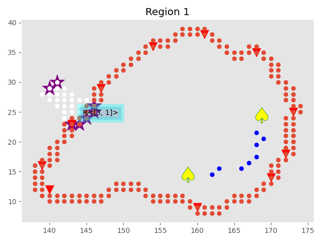

.. include:: ../header.rst

Building Grid - Recipes
=======================

Find wall off building positions in a :class:`.Region`
------------------------------------------------------

* :class:`.Polygon.Buildables`
* :obj:`.Buildables.polygon`
* :obj:`.Buildables.points`
* :meth:`.Buildables.free_pct`
* :meth:`.Region.region_ramps`

.. code-block::

        >>> my_base_raw_location = self.bot.townhalls[0].position
        >>> my_region = self.where_all(my_base_raw_location)[0]
        >>> my_region
        Region 3
        >>> # in most cases  region will have only one ramp,  but there are cases of more than one
        >>> # my_region.region_ramps will evaluate to ~ [<MDRamp[size=33] [Region 3, Region 5]>, <MDRamp[size=58] [Region 3, Region 0]>]

        >>> my_region.region_ramps.sort(key=lambda r: r.area)
        >>> my_region_ramp = my_region.region_ramps[0]
        >>> # my_region_ramp ~  <MDRamp[size=58] [Region 0, Region 3]>
        >>> # my_region_ramp.buildables ~ <MapAnalyzer.Polygon.Buildables object at 0x...>

        >>> # you can also see that these buildable points only belong
        >>> # to this specific Polygon, in our case MDRamp

        >>> # my_region_ramp.buildables.polygon ~ <MDRamp[size=58] [Region 3, Region 0]>

        >>> # low buildable percent makes sense, most of the ramp's Polygon is not buildable
        >>> # my_region_ramp.buildables.free_pct ~ 0.22413793103448276

        >>> # finally,  the buildable points,  which are the ramp wall-off positions
        >>> my_region_ramp.buildables.points # finally,  the buildable points,  which are the ramp wall-off positions
        [(42, 43), (46, 47), (44, 45), (47, 38), (49, 40), (41, 42), (43, 44), (48, 39), (46, 37), (45, 46), (41, 41), (50, 41), (46, 46)]

        >>> # lets plot those buildable points
        >>> x,y = zip(*my_region_ramp.buildables.points)
        >>> # self.debugger.scatter(x,y,color="red",marker=r"$\heartsuit$", s=500, edgecolors="r")
        >>> # self.show()

.. image:: ramp_buildable_raw.png
   :width: 50%

**Hmm, it seems that these points look like they are the upper and lower end of a ramp, lets make sure:**

.. code-block::

        >>> # the perimeter is red by default so we will
        >>> # also,  lets change the heart suit to a simple Star marker and remove the edge color
        >>> self.debugger.scatter(x,y,color="purple",marker='*', s=500)
        >>> my_region.plot()
        >>> # self.show()

